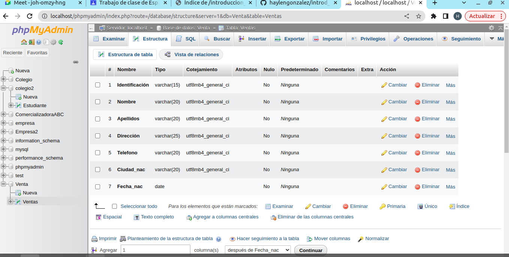
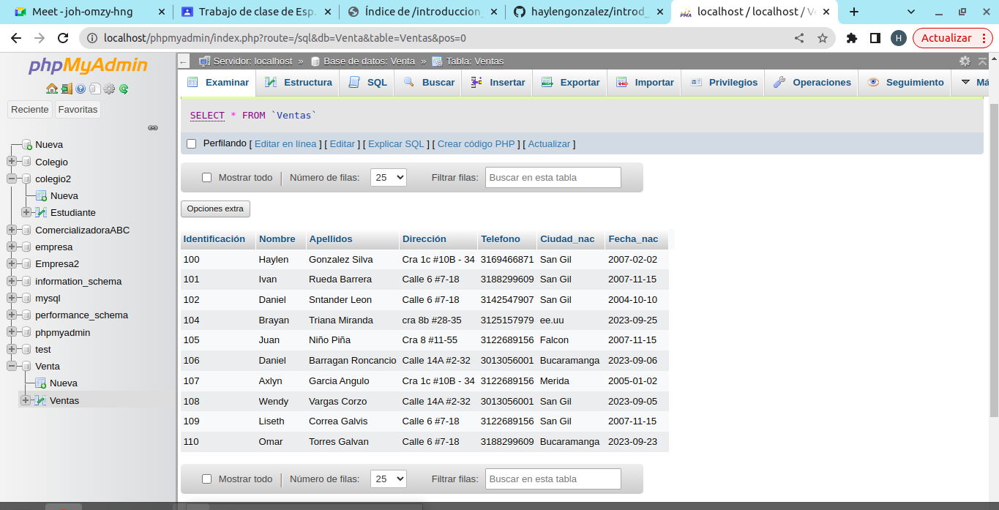

# IMTRODUCCION A SQL

1. Creacion de una base de datos (BD) con MySQL usando phpMyAdmin

## creacion tabla cliente
### DICCIONARIO DE DATOS
|campo|Tipo de dato|Longitud|
|-----|------------|--------|
|identificacion|varchar|15|
|nombre|varchar|20|
|apellidos|varchar|20|
|direccion|varchar|25|
|telefono|varchar|20|
|ciudad_nac|varchar|20|
|fecha_nac|date||

